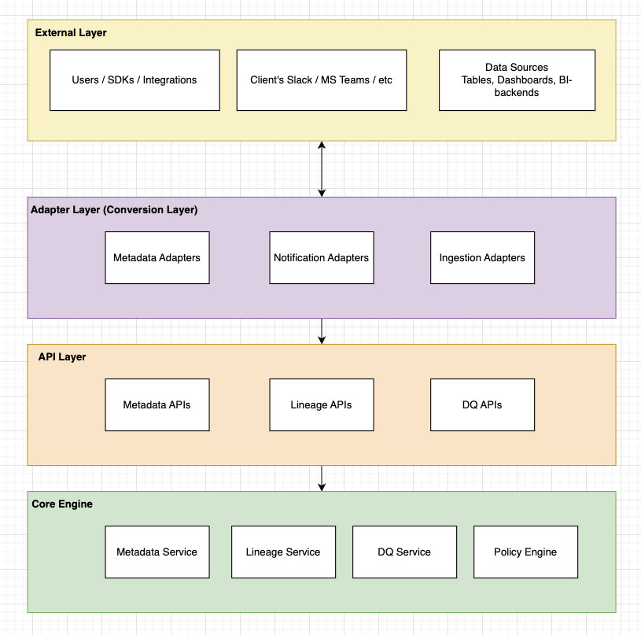
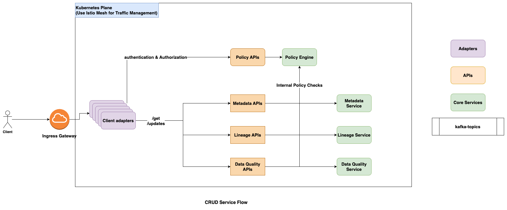

# Atlan Lily v2.0
We’ll be diving deep into the Atlan Lily v2.0 architecture. The Primary problem statements I’ll be attempting to solve are the following - 

## **Functional requirements** 
* **(Inbound, Internal)**: Asset ingestion for clients which have ~1 Billion assets. Approx 90% of which are  columns in different tables and BI fields ,the remaining 10% consists of assets such as databases, schemas, tables, and dashboards. 
* **(Inbound, External)** : Alerting customers for potential table data and data reliability issues early on in near real-time latencies.
* **(Outbound, Internal)** : There are internal enrichment automation requirements towards metadata into Atlan, such that any change in the Atlan entity triggers similar changes to entities connected downstream in lineage from that entity.
* **(Outbound, External)** : A customer of Atlan wants to enforce data access security and compliance. They require that as soon as an entity is annotated as PII or GDPR in Atlan, their downstream data tools become aware of it and enforce access control accordingly.

## **Non Functional Requirements** 
* Selecting an appropriate metadata store to handle such capabilities.
* Schematics when ingesting metadata.
* Authentication and Authorization as first-class citizens in the system.
* Capability for preprocessing and postprocessing wherever needed on the Platform.
* Tenancy as a problem statement in mind, given customers range from comfortable deploying in a multi-tenant setup, to wanting complete isolation in their setup.
* Adaptability to inbound and outbound consumers to scale as per the volume of metadata change events hitting the platform
* Integration with SaaS sources and targets such as Slack, JIRA, MS Teams, Freshdesk, and Okta.
* Cost estimation and ways to optimize.
* Observability of the platform.

## Certain assumptions and out-of-scope elements
- Each and every company we interact with have **~ 1 Billion assets**.
- We refresh for checking the freshness of data for every data source every **24 hours**.
- I’ll utilise **~Kubernetes~** for service deployments and use **~Go~ as the primary programming language** for core engines.
- The logs and metrics for each system is being fetched by individual **fluentD deployments** and each service is instrumented with Open telemetry. The observability stack could be  **Signoz / Jaeger** tracing for OSS options and **ELK** for enterprise APM options. We can maintain the metrics using centralised prometheus deployments.
- The tags associated at the source will override the tags stored in atlan metadata store. Example - 
  - Let’s say a column “**netflix.user_email**” was marked **~public~** in first ingestion by a customer.
  - During data refresh, if the same column has been marked “**~PII~**”, we will be over-riding the tags shown to the user as **PII** (however we will store both the tags intelligently in the event we do need to ensure that user set tags are not overridden).


# Solution

## Breakdown of problem statement.
We can break down the problem statement into the following functional flows - 
1. **Metadata ingestion and lineage updates** :
   1. **(Inbound, internal)** : This flow should focus on the ingestion of metadata from the client sources and storing them in our metadata store.
   2. **(Outbound, Internal):** After the ingestion and lineage updation, we should be looking for verifying the appropriate data quality guardrails and notifying the clients if required.
2. **Metadata enrichment**:
   1. **(Outbound, Internal)** : Once the metadata stores are updated, internal enrichers should update the linearly connected tags. Note - The enrichment **may** occur at the point of ingestion as well.
   2. **(Outbound, External)** : A customer of Atlan wants to enforce data access security and compliance. They require that as soon as an entity is annotated as PII or GDPR in Atlan, their downstream data tools become aware of it and enforce access control accordingly.
3. **Fetching metadata & lineage**: 
   1. Atlan customers wanting to use the metadata stores and the lineage structures.
4. **Real time alerting for data quality checks**
   1. **(Inbound, External)** : Alerting customers for potential table data and data reliability issues early on in near real-time latencies.

## Birds Eye View
To tackle these subproblems, I propose to break down the architecture in the following layers:


### External layer
This comprises of client’s users, data sources like databases, tables, bi dashboards etc. Additionally, these will also contain endpoints for slack integrations for real time alerts.

### Adapter Layer
This layer is the entry point for all external parties to interact with Atlan ecosystem and for the Atlan core systems to interact with external layers. These external components could be
- Atlan users
- Scraping workers (if the clients prefer hosting our workers directly in their ecosystem).

The primary role of this layer will be to 
- **Translate the requests** which clients understand to the spec that internal Atlan systems use and vice versa.
- **Authenticate the inbound requests** from external parties.
- **Adding appropriate authentication** tokens in the outbound requests.

### API Layer
The primary use case of API layer is to present itself as a reusable point of interaction for all the adapters for incoming requests.

This layer will collate requests from multiple core services and serve the same. I propose this layer to be **stateless** and let the core engines handle the retries.

### Core Layer
The core layer is the meat of the system, this is where the requests are actually served. This layer is responsible to serve individual entities like metadata, lineage, data quality checks, policy checks, user level authorizations etc. We’ll dive deep into the major elements right now and elaborate specific workers (like - scraping-worker, notification-workers etc.)

The major ones are elaborated below

## Metadata Service


### Schema & Storage
The metadata store is the crux of the system, it’ll be responsible for storing relevant information for individual asset entity. Please refer to the following schema -

| **Column**     | **Type**      | **Description**                                     | Example                 |
|:--------------:|:-------------:|:---------------------------------------------------:|:-----------------------:|
| asset_id       | STRING        | Unique identifier for the asset.                    | "db_123"                |
| asset_name     | STRING        | Human-readable name of the asset.                   | "subscriptions_db"      |
| asset_type     | STRING        | Type of asset (database, table, column, dashboard). | "database"              |
| asset_owner    | STRING        | Owner of the asset.                                 | "alice"                 |
| created_at     | TIMESTAMP     | Timestamp when the asset was created.               | "2024-02-10"            |
| updated_at     | TIMESTAMP     | Last modification timestamp.                        | "2025-02-15"            |
| data_source    | STRING        | The source system where the asset exists.           | "Netflix"               |
| tags           | ARRAY<STRING> | Labels applied to the asset (e.g., PII, GDPR).      | ["GDPR"]                |
| business_terms | ARRAY<STRING> | Business metadata, such as categorization.          | ["Billing"]             |
| version        | INT           | Version number for tracking metadata changes.       | 3                       |
| is_deleted     | BOOLEAN       | Soft delete flag (true = deleted).                  | FALSE                   |
| external_id    | STRING        | External system reference ID.                       | "ext_db_001"            |
| metadata       | JSON          | Additional metadata fields.                         | {"region": "us-east-1"} |

Considering the following scale as rough calculations for scale 

| **System Component**                               | **Write Rate (Ops/sec)** | **Read Rate (Ops/sec)**  | **Notes**                                                    |
|:--------------------------------------------------:|:------------------------:|:------------------------:|:------------------------------------------------------------:|
| **Metadata Ingestion (Streaming)**                 | 1K - 10K ops/sec         | Low (~500 ops/sec)       | Real-time updates (Kafka-based pipeline, change data capture). |
| **Serving Queries**                                | N/A                      | 10K - 100K ops/sec       | High read workloads (querying metadata, filtering assets).   |
| **Downstream BI Queries (Looker, Superset, etc.)** | Low (~50 ops/sec)        | High (~5K - 20K ops/sec) | BI tools querying metadata frequently.                       |
In principle, it’s a **read heavy system when serving queries for BI dashboards**, however, with a scale of 10k ops/second for ingestion, we still require a storage solution that can **withstand high storage throughput**.

Considering the above limitations, I’d suggest the following storage solutions 
- ~**Apache Iceberg [Preferred due to cost + reliability reasons]**~
  - Can handle the scale limitations.
  - Can easily store non-structured data should we need to update schemas.
  - We can use AWS S3 / GCS for object storage layers.
  - **~Apache Flink~** for compute layer.
  - ~Estimated costs of **$500** / month.~
    - S3 storage of **~10TB** = **$230**
    - Glue Catalogue - $**5** 
    - Data processing units (AWS Glue), assuming 10 DPUs every couple of hours - (10 * 2 * 30 * $0.44) - **$260**
- **Cassandra cluster**
  - The usage of multi-master write heavy use case works well with Cassandra.
  - A ~12 node cluster with 64GB RAM specs and 3 replication factor.
  - ~Estimated costs of **$520** / month~
    - Using Amazon Keyspaces
      - **Monthly Writes:** 10,000 ops/sec * 86,400 seconds/day * 30 days = 25.92 billion writes. = **$144.38 ($5 per mil writes)**
      - **Monthly Reads:** 50,000 ops/sec * 86,400 seconds/day * 30 days = 129.6 billion reads. = **$144.58 ($1.115 per mil reads)**
      - Similar storage costs **$230**.
  
### APIs exposed
The system will have the following **~gRPC APIs~** exposed:
1. `IngestResponse ingestMetadata(Metadata metadata)`
2. `MetadataUpdateResponse updateMetadata(String id, MetadataUpdateRequest request)`

```protobuf
syntax = "proto3";

package metadata;

option go_package = "metadatapb";

// Metadata structure
message Metadata {
  string asset_id = 1;
  string asset_name = 2;
  string asset_type = 3;
  string asset_owner = 4;
  string created_at = 5;
  string updated_at = 6;
  string data_source = 7;
  repeated string tags = 8;
  repeated string business_terms = 9;
  int32 version = 10;
  bool is_deleted = 11;
  string external_id = 12;
  string metadata = 13; // JSON as a string
}

message Error {
  String code = 1;
  String description = 2;
  String entity = 3;
}

// Response for metadata ingestion
message IngestResponse {
  bool success = 1;
  string message = 2;
  repeated Error errors = 3;
}

// Request for updating metadata
message MetadataUpdateRequest {
  string asset_id = 1;
  Metadata updatedMetadata = 2;
}

// Response for metadata update
message MetadataUpdateResponse {
  bool success = 1;
  string message = 2;
  Metadata metadata = 3;
  repeated Error errors = 4;
}

// Request for fetching metadata by asset_id
message GetMetadataRequest {
  string asset_id = 1;
}

// Response for fetching metadata
message GetMetadataResponse {
  bool success = 1;
  string message = 2;
  Metadata metadata = 3;
}


// Metadata gRPC Service
service MetadataService {
  rpc IngestMetadata (Metadata) returns (IngestResponse);
  rpc UpdateMetadata (MetadataUpdateRequest) returns (MetadataUpdateResponse);
  rpc GetMetadata (GetMetadataRequest) returns (GetMetadataResponse);
}

```

### Sample Stubs

```go

package main

import (
	"context"
	"fmt"
	"log"
	"net"

	"metadatapb"

	"github.com/your_project/iceberg"

	"go.opentelemetry.io/otel"
	"go.opentelemetry.io/otel/trace"
	"google.golang.org/grpc"
)

// Server struct
type MetadataServer struct {
	metadatapb.UnimplementedMetadataServiceServer
	icebergClient *iceberg.IcebergClient
	tracer        trace.Tracer
    publisher     *EventPublisher
}

// NewMetadataServer initializes the gRPC server with OpenTelemetry tracing.
func NewMetadataServer(client *iceberg.IcebergClient) *MetadataServer {
	return &MetadataServer{
		icebergClient: client,
		tracer:        otel.Tracer("metadata-service"),
	}
}

// IngestMetadata RPC
func (s *MetadataServer) IngestMetadata(ctx context.Context, event *metadatapb.Metadata) (*metadatapb.IngestResponse, error) {
	ctx, span := s.tracer.Start(ctx, "IngestMetadata")
	defer span.End()

	// Convert request to Iceberg metadata format
	metadata := iceberg.Metadata{
		AssetID:       event.AssetId,
		AssetName:     event.AssetName,
		AssetType:     event.AssetType,
		AssetOwner:    event.AssetOwner,
		CreatedAt:     event.CreatedAt,
		UpdatedAt:     event.UpdatedAt,
		DataSource:    event.DataSource,
		Tags:          event.Tags,
		BusinessTerms: event.BusinessTerms,
		IsDeleted:     event.IsDeleted,
		ExternalID:    event.ExternalId,
		Metadata:      event.Metadata,
	}

	err := s.icebergClient.InsertOrUpdate(metadata)
	if err != nil {
		return &metadatapb.IngestResponse{
			Success: false,
			Message: "Failed to ingest metadata",
			Errors: []*metadatapb.Error{
				{Code: "DB_ERROR", Description: err.Error(), Entity: event.AssetId},
			},
		}, err
	}
    s.publisher.publish(metadata)
	return &metadatapb.IngestResponse{
		Success: true,
		Message: fmt.Sprintf("Metadata for asset %s ingested successfully", metadata.AssetName),
	}, nil
}

// UpdateMetadata RPC
func (s *MetadataServer) UpdateMetadata(ctx context.Context, req *metadatapb.MetadataUpdateRequest) (*metadatapb.MetadataUpdateResponse, error) {
	ctx, span := s.tracer.Start(ctx, "UpdateMetadata")
	defer span.End()

	// Fetch existing metadata
	existingMetadata, err := s.icebergClient.GetMetadata(req.AssetId)
	if err != nil {
		return &metadatapb.MetadataUpdateResponse{
			Success: false,
			Message: "Metadata not found",
			Errors: []*metadatapb.Error{
				{Code: "NOT_FOUND", Description: err.Error(), Entity: req.AssetId},
			},
		}, err
	}

	// Apply updates
	existingMetadata.AssetName = req.UpdatedMetadata.AssetName
	existingMetadata.AssetOwner = req.UpdatedMetadata.AssetOwner
	existingMetadata.UpdatedAt = req.UpdatedMetadata.UpdatedAt
	existingMetadata.Tags = req.UpdatedMetadata.Tags
	existingMetadata.BusinessTerms = req.UpdatedMetadata.BusinessTerms
	existingMetadata.Metadata = req.UpdatedMetadata.Metadata

	// Upsert updated metadata
	err = s.icebergClient.InsertOrUpdate(*existingMetadata)
	if err != nil {
		return &metadatapb.MetadataUpdateResponse{
			Success: false,
			Message: "Failed to update metadata",
			Errors: []*metadatapb.Error{
				{Code: "DB_ERROR", Description: err.Error(), Entity: req.AssetId},
			},
		}, err
	}
    s.publisher.publish(req.Metadata)
	return &metadatapb.MetadataUpdateResponse{
		Success:  true,
		Message:  fmt.Sprintf("Metadata for asset %s updated successfully", req.AssetId),
		Metadata: req.UpdatedMetadata,
	}, nil
}

// GetMetadata RPC
func (s *MetadataServer) GetMetadata(ctx context.Context, req *metadatapb.GetMetadataRequest) (*metadatapb.GetMetadataResponse, error) {
	ctx, span := s.tracer.Start(ctx, "GetMetadata")
	defer span.End()

	metadata, err := s.icebergClient.GetMetadata(req.AssetId)
	if err != nil {
		return &metadatapb.GetMetadataResponse{
			Success: false,
			Message: "Metadata not found",
		}, err
	}

	// Convert to gRPC response format
	response := &metadatapb.GetMetadataResponse{
		Success: true,
		Message: "Metadata fetched successfully",
		Metadata: &metadatapb.Metadata{
			AssetId:    metadata.AssetID,
			AssetName:  metadata.AssetName,
			AssetType:  metadata.AssetType,
			AssetOwner: metadata.AssetOwner,
			CreatedAt:  metadata.CreatedAt,
			UpdatedAt:  metadata.UpdatedAt,
			DataSource: metadata.DataSource,
			Tags:       metadata.Tags,
			Version:    int32(metadata.Version),
			IsDeleted:  metadata.IsDeleted,
			ExternalId: metadata.ExternalID,
			Metadata:   metadata.Metadata,
		},
	}
	return response, nil
}

```

## Lineage Service

A graph database will be perfect for storing lineages for high depth patterns, I have explored JanusGraphs and ArangoDB for the scale of **~5k ops/sec writes**.

### Why not store it in metadata server itself? 
Storing the relationships in iceberg itself might get tricky when the depth is increased causing recursive join queries.


### Schema Storage

**Vertices**
| **Property Name** | **Type**     | **Description**                               |
|:-----------------:|:------------:|:---------------------------------------------:|
| asset_id          | String       | Unique identifier for the asset               |
| asset_name        | String       | Name of the asset                             |
| asset_type        | String       | Type of asset (database, table, column, etc.) |
| data_source       | String       | Source system (Netflix, Google, etc.)         |
| tags              | List<String> | List of tags (e.g., PII, GDPR)                |
| owner             | String       | Owner of the asset                            |
| created_at        | Date         | Creation timestamp                            |
| updated_at        | Date         | Last updated timestamp                        |
| is_deleted        | Boolean      | If delted or not                              |
**Edges**
| **Edge Label** | **From Vertex (asset_type)** | **To Vertex (asset_type)** | **Description**                                              |
|:--------------:|:----------------------------:|:--------------------------:|:------------------------------------------------------------:|
| RELATIONSHIP   | Parent Asset                 | Child Asset                | “derived-from” (table -view), “used-in” (column-bi), “contains”(db - table) etc. |

### Infrastructure 
My primary consideration will be looking at the following graph databases:
1. ~**ArangoDB [Preferred]**~
   1. With a smaller 3 nodes setup, it should be able to handle the prescribed lineage update load.
   
| **Component** | **Instance Type** | **Nodes** | **Cost per Node (Monthly)** | **Total Cost** |
|:-:|:-:|:-:|:-:|:-:|
| **Compute (EC2)** | r5.2xlarge (8 vCPUs, 64GB RAM) | 3 | $565 | **$1,695** |
| **Storage (EBS SSD - 5TB total)** | GP3 (5000 IOPS) | 3 | $460 | **$1,380** |
| **Networking (Data Transfer, 10TB/month)** | - | - | $200 | **$200** |
***
2. **Janus graph backed by Apache Cassandra.**
   1. With a 6 nodes setup, it’ll cost approximately **~$8,000 per month**. Quite pricey!

| **Component** | **Cost/Unit** | **Quantity** | **Monthly Cost** |
|:-:|:-:|:-:|:-:|
| EC2 instances | $1.50/hour | 6 nodes | **$6,480** |
| EBS storage | $0.10/GB | 6TB | **$600** |
| Networking (est) | $0.09/GB | 10TB | **$900** |
| **Total Cost** | **-** | **-** | **$7,980** |
### APIs exposed
The system will have the following **~gRPC APIs~** exposed:
1. `IngestRelationships (Relationship) returns (GenericMessage);`
2. `PropagateUpdateDownstream (MetadataPropagationRequest) returns (GenericMessage);`
3. `rpc GetLineage (GetLineageRequest) returns (GetLineageResponse);`


```protobuf
syntax = "proto3";

package lineage;

option go_package = "lineagepb";

// Represents an asset relationship
message Relationship {
  string from_asset_id = 1;
  string to_asset_id = 2;
  string relationship_type = 3; // e.g., "derived-from", "used-in", "contains"
}

// Metadata structure (Reusing from MetadataService)
message Metadata {
  string asset_id = 1;
  string asset_name = 2;
  string asset_type = 3;
  string asset_owner = 4;
  string created_at = 5;
  string updated_at = 6;
  string data_source = 7;
  repeated string tags = 8;
  repeated string business_terms = 9;
  int32 version = 10;
  bool is_deleted = 11;
  string external_id = 12;
  string metadata = 13; // JSON as a string
}

// Generic response message
message GenericMessage {
  bool success = 1;
  string message = 2;
}

// Request for lineage propagation
message MetadataPropagationRequest {
  Metadata updated_metadata = 1;
}

// Request for fetching lineage with filters
message GetLineageRequest {
  string asset_id = 1;
  int32 depth = 2;        // Depth of lineage to traverse
  bool remove_deleted = 3; // Filter out deleted assets
}

// Response for lineage request
message GetLineageResponse {
  bool success = 1;
  string message = 2;
  repeated Relationship lineage = 3;
}

// Lineage gRPC Service
service LineageService {
  // Ingest relationships between assets
  rpc IngestRelationships (Relationship) returns (GenericMessage);

  // Propagate metadata updates downstream
  rpc PropagateUpdateDownstream (MetadataPropagationRequest) returns (GenericMessage);

  // Fetch lineage for a given asset
  rpc GetLineage (GetLineageRequest) returns (GetLineageResponse);
}

```

### Sample Stubs
```go
func (s *LineageServer) IngestRelationships(ctx context.Context, req *pb.Relationship) (*pb.GenericMessage, error) {
	ctx, span := tracer.Start(ctx, "IngestRelationships")
	defer span.End()

	collection, err := db.Collection(ctx, "relationships")
	if err != nil {
		return &pb.GenericMessage{Success: false, Message: "Failed to access collection"}, err
	}

	relationship := map[string]interface{}{
		"from_asset_id":    req.FromAssetId,
		"to_asset_id":      req.ToAssetId,
		"relationship_type": req.RelationshipType,
	}

	_, err = collection.CreateDocument(ctx, relationship)
	if err != nil {
		return &pb.GenericMessage{Success: false, Message: "Failed to store relationship"}, err
	}

	return &pb.GenericMessage{Success: true, Message: "Relationship stored successfully"}, nil
}

// **2. Propagate Update Downstream**
func (s *LineageServer) PropagateUpdateDownstream(ctx context.Context, req *pb.MetadataPropagationRequest) (*pb.GenericMessage, error) {
	ctx, span := tracer.Start(ctx, "PropagateUpdateDownstream")
	defer span.End()

	event, err := json.Marshal(req.UpdatedMetadata)
	if err != nil {
		return &pb.GenericMessage{Success: false, Message: "Failed to serialize metadata"}, err
	}

	err = kafkaProducer.Produce(&kafka.Message{
		TopicPartition: kafka.TopicPartition{Topic: &"metadata-update-propagation-events", Partition: kafka.PartitionAny},
		Value:          event,
	}, nil)

	if err != nil {
		return &pb.GenericMessage{Success: false, Message: "Failed to publish event"}, err
	}

	return &pb.GenericMessage{Success: true, Message: "Metadata update event published"}, nil
}

// **3. Get Lineage**
func (s *LineageServer) GetLineage(ctx context.Context, req *pb.GetLineageRequest) (*pb.GetLineageResponse, error) {
	ctx, span := tracer.Start(ctx, "GetLineage")
	defer span.End()

	query := fmt.Sprintf(`
		FOR v, e, p IN 1..%d OUTBOUND @asset_id GRAPH 'lineage_graph'
		FILTER @removeDeleted == false OR v.is_deleted == false
		RETURN e
	`, req.Depth)

	cursor, err := db.Query(ctx, query, map[string]interface{}{
		"asset_id":      req.AssetId,
		"removeDeleted": req.RemoveDeleted,
	})
	if err != nil {
		return &pb.GetLineageResponse{Success: false, Message: "Query execution failed"}, err
	}
	defer cursor.Close()

	var relationships []*pb.Relationship
	for cursor.HasMore() {
		var edge map[string]string
		_, err := cursor.ReadDocument(ctx, &edge)
		if err != nil {
			return &pb.GetLineageResponse{Success: false, Message: "Failed to parse response"}, err
		}

		relationships = append(relationships, &pb.Relationship{
			FromAssetId:      edge["from_asset_id"],
			ToAssetId:        edge["to_asset_id"],
			RelationshipType: edge["relationship_type"],
		})
	}

	return &pb.GetLineageResponse{Success: true, Message: "Lineage retrieved", Lineage: relationships}, nil
}
```

### Policy Engine

The role of policy engine will be to be a central store for 
1. Verifying if a user has access to certain asset or not.
2. Verifying if a scraper has access to update certain column or not.
This will be a high read throughput system (**~50k ops/sec**) for such a use case, relational databases / in-memory key stores will work well.  

### Schema & infrastructure 

| **Tables**           | **Description**                               |
|:--------------------:|:---------------------------------------------:|
| **policies**         | Stores access rules (who can access what).    |
| **roles**            | Defines user roles (e.g., Admin, Analyst).    |
| **users**            | Stores user details and assigned roles.       |
| **scraper_policies** | Defines rules for scrapers (allowed columns). |
#### Policy Table Schema
| **Column** | **Type** | **Description** |
|:-:|:-:|:-:|
| **policy_id** | STRING (UUID) | Unique policy ID. |
| **asset_id** | STRING | Asset being protected (table, column, etc.). |
| **user_id** | STRING | User ID or Role ID with access. |
| **access_type** | ENUM(READ, WRITE, DELETE) | Defines what action is allowed. |
| **conditions** | JSON | Optional conditions (e.g., time-based access). |
| **created_at** | TIMESTAMP | Timestamp when the policy was created. |
#### Scraper Policy Table
| **Column**          | **Type**      | **Description**                     |
|:-------------------:|:-------------:|:-----------------------------------:|
| **policy_id**       | STRING (UUID) | Unique ID for scraper policy.       |
| **scraper_gropu**   | STRING        | Scraper group for the data source   |
| **allowed_columns** | ARRAY(STRING) | List of columns scraper can access. |
| **created_at**      | TIMESTAMP     | Timestamp of creation.              |
I’d love to use a standard **PostgreSQL** database to support these relational tables.

### Data Quality Engine
The data quality engine will be responsible for early catching any possible fault / anomaly in the data. But first, let’s focus on what it means to have fault / anomalies in data when it’s solely column being used?

1. Is a certain column being used by multiple queries suddenly dropped / marked private?
   1. **The downstream assets might break**.
2. Is a certain dashboard suddenly reporting less queries per second?
   1. There might be an issue in access to the dashboard.
3. Is a certain asset having no downstream component with no one using it? 
   1. This might be an **orphaned asset**.
In such scenarios, we’d want the data quality engine to report such anomalies to the appropriate client integrations.

For the scope of this document, I’ll be focussing on this **assumption**:
- We’ll be receiving events with query counts for certain assets and we will have a policy to alert appropriate **notification systems** if the average query count deviates by **15% over last 7 days**.

## Flink Code & Policy Schemas
### **Policies Table - Postgres**
| **Column** | **Type** | **Description** |
|:-:|:-:|:-:|
| id | UUID (PK) | Unique Policy ID |
| asset_id | TEXT | Asset ID to monitor |
| policy_type | TEXT | unused_for_x_days, query_spike, deleted_asset |
| threshold | INT | Condition threshold (e.g., 10 days, 1000 queries) |
| created_at | TIMESTAMP | Timestamp when policy was added |
| updated_at | TIMESTAMP | Last updated timestamp |
### **Notification Table  - Postgres**
| **Column** | **Type**  | **Description**                 |
|:----------:|:---------:|:-------------------------------:|
| id         | UUID (PK) | Unique notification settings ID |
| asset_id   | TEXT      | Asset ID to monitor             |
| endpoint   | TEXT      | slack / client webhook URL      |
| created_at | TIMESTAMP | Timestamp when policy was added |
| updated_at | TIMESTAMP | Last updated timestamp          |
### **Flink integration** 
```java
import org.apache.flink.api.common.eventtime.WatermarkStrategy;
import org.apache.flink.api.common.functions.AggregateFunction;
import org.apache.flink.api.common.serialization.SimpleStringSchema;
import org.apache.flink.connector.kafka.source.KafkaSource;
import org.apache.flink.connector.kafka.sink.KafkaSink;
import org.apache.flink.connector.kafka.source.enumerator.initializer.OffsetsInitializer;
import org.apache.flink.connector.kafka.sink.KafkaRecordSerializationSchema;
import org.apache.flink.streaming.api.datastream.DataStream;
import org.apache.flink.streaming.api.environment.StreamExecutionEnvironment;
import org.apache.flink.streaming.api.windowing.assigners.TumblingEventTimeWindows;
import org.apache.flink.streaming.api.windowing.time.Time;
import org.apache.flink.util.Collector;
import org.apache.flink.api.common.state.*;
import org.apache.flink.configuration.Configuration;
import org.apache.flink.streaming.api.functions.KeyedProcessFunction;
import org.apache.flink.api.common.functions.MapFunction;
import org.apache.flink.api.common.functions.ReduceFunction;
import com.fasterxml.jackson.databind.JsonNode;
import com.fasterxml.jackson.databind.ObjectMapper;
import java.sql.Connection;
import java.sql.DriverManager;
import java.sql.PreparedStatement;
import java.time.Instant;
import java.util.Properties;

public class QueryAnomalyDetection {
    
    public static void main(String[] args) throws Exception {
        final StreamExecutionEnvironment env = StreamExecutionEnvironment.getExecutionEnvironment();

        env.enableCheckpointing(60000);  // Enable checkpointing for fault tolerance

        // Kafka Source
        KafkaSource<String> source = KafkaSource.<String>builder()
            .setBootstrapServers("kafka-broker:9092")
            .setTopics("metadata-events")
            .setGroupId("query-anomaly-group")
            .setStartingOffsets(OffsetsInitializer.latest())
            .setValueOnlyDeserializer(new SimpleStringSchema())
            .build();

        DataStream<String> metadataStream = env.fromSource(
            source, WatermarkStrategy.noWatermarks(), "Kafka Metadata Source"
        ).name("Metadata Stream");

        // Parse JSON events
        DataStream<QueryEvent> parsedStream = metadataStream.map(new ParseEventFunction());

        // Detect anomalies using historical query counts
        DataStream<String> anomalies = parsedStream
            .keyBy(event -> event.assetId)
            .window(TumblingEventTimeWindows.of(Time.days(1)))
            .aggregate(new QueryCountAggregator())
            .keyBy(event -> event.assetId)
            .process(new AnomalyDetectionFunction());

        // Kafka Sink for anomaly events
        KafkaSink<String> notificationSink = KafkaSink.<String>builder()
            .setBootstrapServers("kafka-broker:9092")
            .setRecordSerializer(KafkaRecordSerializationSchema.builder()
                .setTopic("notification-events")
                .setValueSerializationSchema(new SimpleStringSchema())
                .build()
            )
            .build();

        anomalies.sinkTo(notificationSink).name("Notification Sink");

        env.execute("Query Anomaly Detection");
    }

    // JSON Parser
    public static class ParseEventFunction implements MapFunction<String, QueryEvent> {
        private static final ObjectMapper mapper = new ObjectMapper();

        @Override
        public QueryEvent map(String value) throws Exception {
            JsonNode node = mapper.readTree(value);
            return new QueryEvent(
                node.get("asset_id").asText(),
                node.get("query_count").asInt(),
                Instant.parse(node.get("timestamp").asText()).toEpochMilli()
            );
        }
    }

    // Aggregator for historical query count
    public static class QueryCountAggregator 
            implements AggregateFunction<QueryEvent, QueryStats, QueryStats> {

        @Override
        public QueryStats createAccumulator() {
            return new QueryStats();
        }

        @Override
        public QueryStats add(QueryEvent event, QueryStats accumulator) {
            accumulator.totalCount += event.queryCount;
            accumulator.numDays++;
            return accumulator;
        }

        @Override
        public QueryStats getResult(QueryStats accumulator) {
            return accumulator;
        }

        @Override
        public QueryStats merge(QueryStats a, QueryStats b) {
            return new QueryStats(a.totalCount + b.totalCount, a.numDays + b.numDays);
        }
    }

    // Anomaly Detection Function
    public static class AnomalyDetectionFunction 
            extends KeyedProcessFunction<String, QueryStats, String> {
        private transient ValueState<Double> historicalAvgState;

        @Override
        public void open(Configuration parameters) throws Exception {
            ValueStateDescriptor<Double> descriptor = 
                new ValueStateDescriptor<>("historicalAvg", Double.class);
            historicalAvgState = getRuntimeContext().getState(descriptor);
        }

        @Override
        public void processElement(QueryStats stats, Context ctx, Collector<String> out) throws Exception {
            double newAvg = stats.totalCount / (double) stats.numDays;
            Double oldAvg = historicalAvgState.value();
            
            if (oldAvg != null && Math.abs((newAvg - oldAvg) / oldAvg) > 0.15) {
                // Detected anomaly
                String message = "Anomaly detected for asset: " + ctx.getCurrentKey();
                out.collect(message);
            }

            // Update state with new average
            historicalAvgState.update(newAvg);
        }
    }

    // Query Event POJO
    public static class QueryEvent {
        public String assetId;
        public int queryCount;
        public long timestamp;

        public QueryEvent(String assetId, int queryCount, long timestamp) {
            this.assetId = assetId;
            this.queryCount = queryCount;
            this.timestamp = timestamp;
        }
    }

    // Query Statistics POJO
    public static class QueryStats {
        public int totalCount;
        public int numDays;

        public QueryStats() {
            this.totalCount = 0;
            this.numDays = 0;
        }

        public QueryStats(int totalCount, int numDays) {
            this.totalCount = totalCount;
            this.numDays = numDays;
        }
    }
}
```

# Flows
These are the core systems of my solution, if required, I’ll explain certain services within the flows.
## [Ingestion Flow](https://drive.google.com/file/d/1NStOr00vcmoEYcvNm1HJK4O_dggsPkzw/view?usp=sharing)
Note: The events being asynchronous could be either **~Kafka topics~** or **AWS Kinesis,** for the time being, we’ll consider this system to be Kafka (for easier integration with Apache Flink in DQ).

Also, we are assuming this is a **~multi-tenant setup~**, a single tenant setup will simply redeploy the entire architecture alone.

In the ingestion flow will look like the following :
- The scraping adapters will be triggered upon receiving a scraping job from **scraping-job-events.**
- The scrapping adapters will check the policy engine whether they have the access to certain assets or not, if they do they’ll send these as events in **asset-ingestion-events**.
- The ingestion adapters will identify the events based on whether these are:
  - **Metatada event** (tag of a dashboard is updated, new table is created).
  - **Lineage event** (new view is derived from existing table, a new ETL pipeline has been created).
  - And accordingly call the API layer after a authentication check.
- Metadata and Lineage APIs will call appropriate gRPC stubs in respective services.
  - **The metadata update events will be ingested by lineage service** if there is update of tags (PII) / asset deletion.
  - **The lineage update events will be ingested by metadata service** to update the downstream asset’s tags if required (ex - attaching PII tag to all downstream assets in Breadth First Search fashion.).
  - Both the services will utilise event’s created at times to handle re-ingestion of conflicting old events.
- From the metadata-events, the following post-processing pipelines will be triggered - 
  - Other metadata enrichers can perform enrichments to their metadata and call update API in metadata server.
  - **Data Quality Engine** can receive lineage and metadata updates and accordingly send notifications if required.
  - **Metadata Refresher** will schedule jobs for refreshing metadata based on certain assets. Imagine it to be using [Quartz Scheduler](https://www.quartz-scheduler.org/) / Custom cron + RDBMS combination to achieve the same.
- The notification adapters will utilise appropriate web hook urls + events to talk to Slack / SAAS integrations.

## [Metadata Read / Update flows](https://drive.google.com/file/d/1NoAYpQH-E2_bvEIWZ9PM1i08-ZjhbWWN/view?usp=sharing)

The general CRUD flow should look like the following:
1. The clients of Atlan will interact with their appropriate client tokens which can be authenticated and verified in the **Policy Engine**.
   1. We can attach scopes to the token to verify if the client has the ability to call this certain API or not.
2. The individual request shall be routed to appropriate API depending on the use case.
3. The individual API layers shall again check if the client has access to the certain API asset or not and fetch the same from appropriate engine.
4. The adapter layer shall perform the conversion of atlan’s contract to client contracts (if needed).
# Possible Improvements?
- We could’ve further separated the notification settings and data quality policies by extracting the notification components in a separate “**notification-service”**.
- We can use NATS servers if we want broker-less change data capture across services as an alternative  to Kafka. Additionally we can use 0MQ if we need custom serialising / deserialising (Although Kafka already supports protobuf based serialises so shouldn’t be an issue).
- We could dive deeper into security mechanisms required for external client comms with our adapters. 
  - For the inbound communication, **mTLS** should suffice with predefined bearer auth tokens. If required, we can attach SSO policies as well.
  - For the outbound communication, we can again utilise **mTLS** + **dynamic signature checks** which can be verified by the clients.